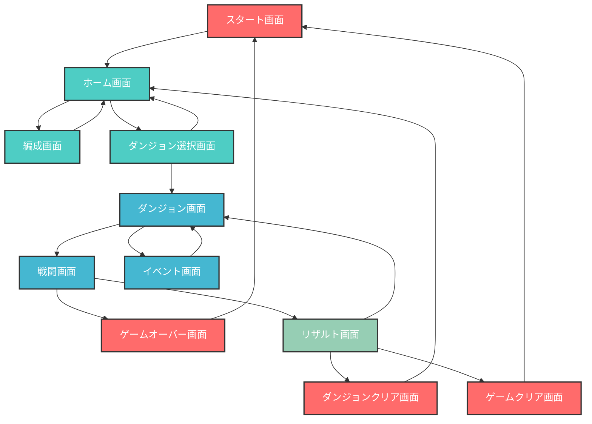

# Browser RPG - 開発環境・ディレクトリ構成

## 開発環境

### 参照しなくていいファイルやディレクトリ

#### node.js が使うディレクトリ

node_modules

#### Next.js の出力結果

- .next
- out
- build

#### プロンプトを管理するために使う一時的なディレクトリ

- tmp

ただし、これは指示がある場合プロンプトとして利用する

### フレームワーク・技術スタック
- **Next.js 15.5.0** (React 19.1.0)
- **TypeScript 5.x**
- **Tailwind CSS 4.x**
- **ESLint** (コード品質管理)

### 開発コマンド
```bash
# 開発サーバー起動 (Turbopack使用)
npm run dev

# プロダクションビルド (Turbopack使用)
npm run build

# プロダクションサーバー起動
npm start

# リント実行
npm run lint

# TypeScript型チェック
npx tsc --noEmit
```

### TypeScript設定
- ターゲット: ES2017
- 厳密モード有効
- パスエイリアス: `@/*` → プロジェクトルート
- Next.js プラグイン使用

## ディレクトリ構成

```
browser-rpg/
├── app/                    # Next.js App Router
│   ├── favicon.ico
│   ├── globals.css         # グローバルスタイル
│   ├── layout.tsx          # ルートレイアウト
│   └── page.tsx            # ホームページ
├── public/                 # 静的ファイル
│   ├── file.svg
│   ├── globe.svg
│   ├── next.svg
│   ├── vercel.svg
│   └── window.svg
├── CLAUDE.md              # このファイル
├── README.md              # プロジェクト説明
├── eslint.config.mjs      # ESLint設定
├── next.config.ts         # Next.js設定
├── next-env.d.ts          # Next.js型定義
├── package.json           # 依存関係・スクリプト
├── postcss.config.mjs     # PostCSS設定
└── tsconfig.json          # TypeScript設定
```

## 主な特徴

- **App Router**: Next.js 15の最新App Routerを使用
- **Turbopack**: 高速な開発・ビルド体験
- **型安全性**: TypeScriptによる厳密な型チェック
- **モダンスタイリング**: Tailwind CSS 4.xによるユーティリティファーストCSS
- **React 19**: 最新のReact機能を活用可能

## ゲーム概要

ブラウザで動作するRPGゲーム

## ゲームフロー



### 画面構成

| 画面名 | 説明 | 遷移先 |
|--------|------|--------|
| スタート画面 | ゲーム開始画面 | ホーム画面 |
| ホーム画面 | メイン画面 | 編成画面、ダンジョン選択画面 |
| 編成画面 | パーティ編成 | ホーム画面 |
| ダンジョン選択画面 | ダンジョン選択 | ホーム画面、ダンジョン画面 |
| ダンジョン画面 | ダンジョン探索 | 戦闘画面、イベント画面 |
| 戦闘画面 | バトル | ゲームオーバー画面、リザルト画面 |
| イベント画面 | イベント発生 | ダンジョン画面 |
| リザルト画面 | 戦闘結果 | ダンジョン画面、ダンジョンクリア画面、ゲームクリア画面 |
| ゲームオーバー画面 | 敗北時 | スタート画面 |
| ダンジョンクリア画面 | ダンジョン完了 | ホーム画面 |
| ゲームクリア画面 | ゲーム完了 | スタート画面 |

## テスト環境

### ユニットテスト
- **Vitest** + **React Testing Library**
- テスト実行: `npm test`

### テストファイル構成（__tests__ ディレクトリ集約型）

#### 例

```
__tests__/
├── components/
│   ├── Button.test.tsx
│   ├── CharacterCard.test.tsx
│   └── BattleInterface.test.tsx
├── pages/
│   ├── home.test.tsx
│   ├── party.test.tsx
│   ├── dungeon/
│   │   ├── select.test.tsx
│   │   ├── explore.test.tsx
│   │   ├── battle.test.tsx
│   │   └── result.test.tsx
│   ├── game-over.test.tsx
│   └── game-clear.test.tsx
├── hooks/
│   ├── useGameState.test.ts
│   ├── useBattle.test.ts
│   └── useParty.test.ts
└── utils/
    ├── gameLogic.test.ts
    ├── damageCalculation.test.ts
    └── itemEffects.test.ts
```

### テスト優先順位

1. **Critical Path**: ゲーム進行に必須の機能
2. **User Interactions**: ボタンクリック、入力など
3. **Edge Cases**: エラー状態、境界値
4. **UI Components**: レンダリング確認

## コーディングルール

- anyは使わない
- 例外は握りつぶさない
- null を使わず undefined を使う