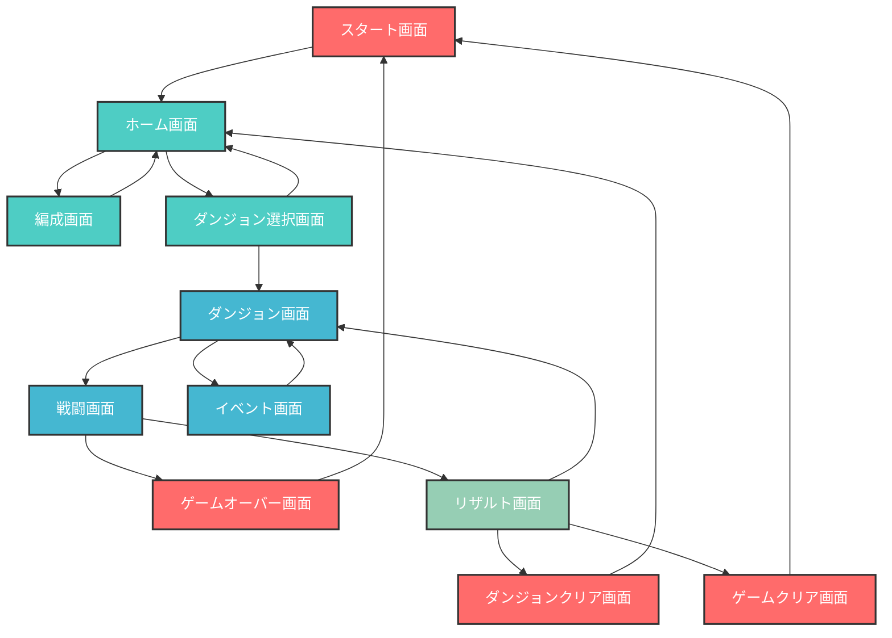

# Browser RPG

ブラウザで動作するRPGゲームです。

## 技術スタック

- **Next.js 15.5.0** (React 19.1.0)
- **TypeScript 5.x**
- **Tailwind CSS 4.x**
- **ESLint** (コード品質管理)

## 開発環境セットアップ

### 依存関係のインストール

```bash
npm install
```

### 開発サーバー起動

```bash
npm run dev
```

[http://localhost:3000](http://localhost:3000) でアプリケーションを確認できます。

### その他のコマンド

```bash
# プロダクションビルド (Turbopack使用)
npm run build

# プロダクションサーバー起動
npm start

# リント実行
npm run lint

# TypeScript型チェック
npx tsc --noEmit

# テスト実行
npm test

# カバレッジ付きテスト
npm run test:coverage
```

## ゲーム概要

### ゲームフロー



### 主要機能

- パーティ編成システム
- ダンジョン探索
- ターンベース戦闘
- イベントシステム
- 進行管理（ダンジョンクリア・ゲームクリア）

## 開発について

- **App Router**: Next.js 15の最新App Routerを使用
- **Turbopack**: 高速な開発・ビルド体験
- **型安全性**: TypeScriptによる厳密な型チェック
- **モダンスタイリング**: Tailwind CSS 4.xによるユーティリティファーストCSS

詳細な開発ガイドは `CLAUDE.md` を参照してください。
